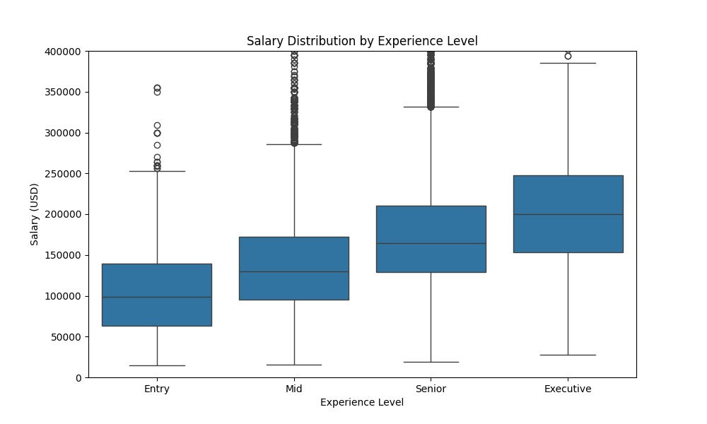
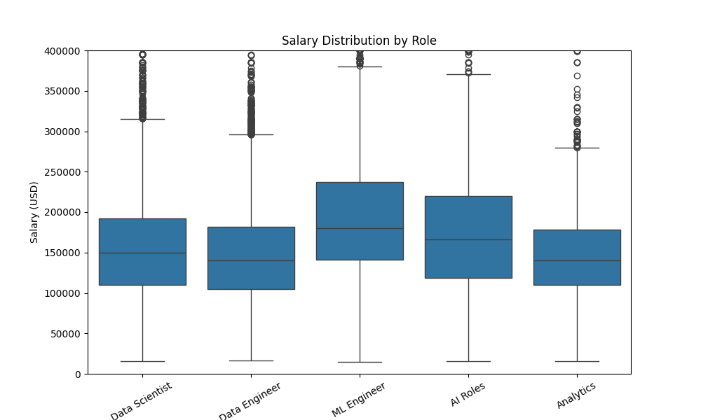
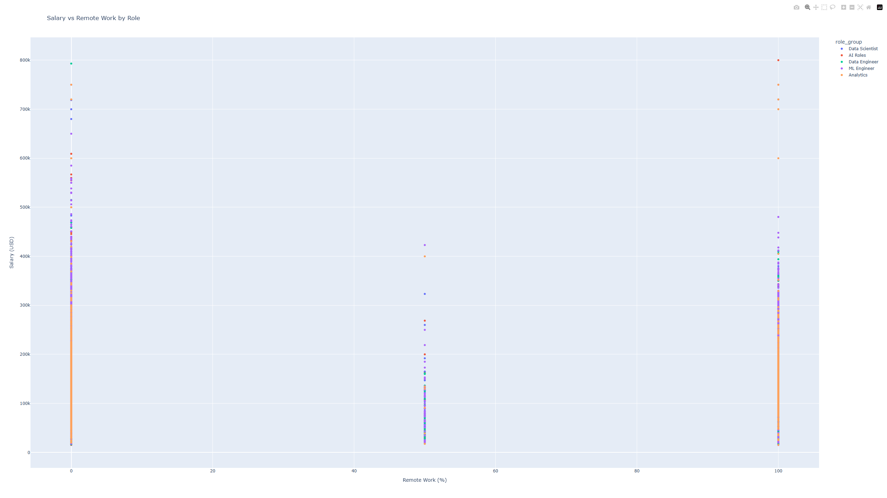
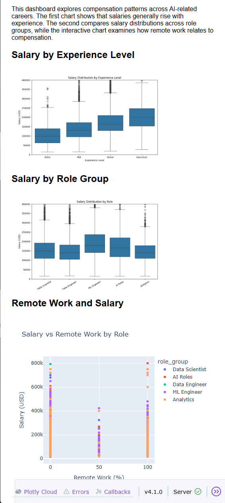

# Module 10 — Data Dashboard (Seaborn, Plotly, Dash)

**Name:** Andres Sanchez-Castellanos  
**JHED ID:** asanch69  
**Course:** EN.605.256 Modern Software Concepts in Python  
**Module:** Module 10 — Data Dashboard

---

# Sources

- Course lecture materials  
- pandas documentation  
- seaborn documentation  
- matplotlib documentation  
- plotly documentation  
- dash documentation  
- ChatGPT  

---

# Overview

Module 10 focuses on building a **data visualization dashboard** to analyze salary trends in AI-related careers.

This module introduces:

1. **Exploratory Data Analysis (EDA)**  
The dataset is filtered and structured to focus on AI-related roles and full-time positions.

2. **Static Visualizations (Seaborn & Matplotlib)**  
Salary distributions are analyzed using boxplots to compare:
- Experience levels  
- Job roles  

3. **Interactive Visualization (Plotly)**  
An interactive scatter plot explores the relationship between salary and remote work.

4. **Dashboard Development (Dash)**  
All visualizations are integrated into a single interactive dashboard with explanatory insights.

---

# Research Question

How do salary levels vary across experience levels, job roles, and remote work opportunities in AI-related careers?

---

# Data Preparation

The dataset used:

ds_salaries.csv

Processing steps:

- Filtered for full-time employees  
- Filtered for AI-related roles using keywords:
  - Data Scientist  
  - Data Engineer  
  - Machine Learning  
  - AI  
  - Analytics  
- Mapped experience levels:
  - EN → Entry  
  - MI → Mid  
  - SE → Senior  
  - EX → Executive  
- Grouped job titles into broader role categories  

---

# Visualization 1 — Salary by Experience Level

This boxplot shows salary distribution across experience levels.

Observations:

- Salaries increase consistently from Entry → Executive  
- Median salary rises significantly at each level  
- Higher experience levels show greater variance  
- Outliers appear more frequently in senior roles  

Interpretation:

Experience is the strongest predictor of salary growth in AI-related careers.

---

# Visualization 2 — Salary by Role

This boxplot compares salary distributions across job roles.

Observations:

- Machine Learning Engineers have the highest median salaries  
- Data Scientists follow closely behind  
- Analytics roles have the lowest median salaries  
- AI roles show a wide range of compensation  

Interpretation:

Specialized technical roles command higher salaries than general analytics roles.

---

# Visualization 3 — Salary vs Remote Work (Interactive)

Interactive version:

[Plotly Interactive Chart](plots/plot_3_interactive.html)

This scatter plot explores the relationship between salary and remote work.

Observations:

- Remote work levels cluster around 0%, 50%, and 100%  
- High salaries appear at all remote levels  
- No strong linear relationship between remote work and salary  

Interpretation:

Remote work availability does not significantly impact salary; experience and role are more important factors.

---

# Dashboard

The dashboard was built using Dash and displays:

- Salary by experience level  
- Salary by role  
- Interactive remote work analysis  

It includes:

- The research question as the title  
- A short explanatory summary  
- Clean layout for readability  

Screenshot:

---

# Key Observations

- Salary increases strongly with experience level  
- Machine learning and AI roles have higher compensation  
- Analytics roles tend to have lower salaries  
- Remote work does not significantly determine salary  
- Variability increases at higher experience levels  

---

# Repository Structure

module_10/

visualization.py  
dashboard.py  
requirements.txt  
README.md  

data/  
plots/  

dashboard.png  

---

# Running the Code

Step 1 — Install dependencies:

    pip install -r requirements.txt

Step 2 — Generate visualizations:

    python visualization.py

Step 3 — Run dashboard:

    python dashboard.py

Then open:

http://127.0.0.1:8050/

---

# Final Deliverables

Submitted to Canvas:

module_10.zip

GitHub repository contains:

- Visualization scripts  
- Dashboard application  
- Generated plots  
- Documentation  

---

# Summary

This module demonstrates a complete data analysis and visualization workflow:

- Data cleaning and filtering  
- Exploratory data analysis  
- Static visualization (Seaborn & Matplotlib)  
- Interactive visualization (Plotly)  
- Dashboard development (Dash)  

The answers the research question by showing that **experience and role specialization are the primary drivers of salary in AI careers**, while remote work has a limited direct impact.