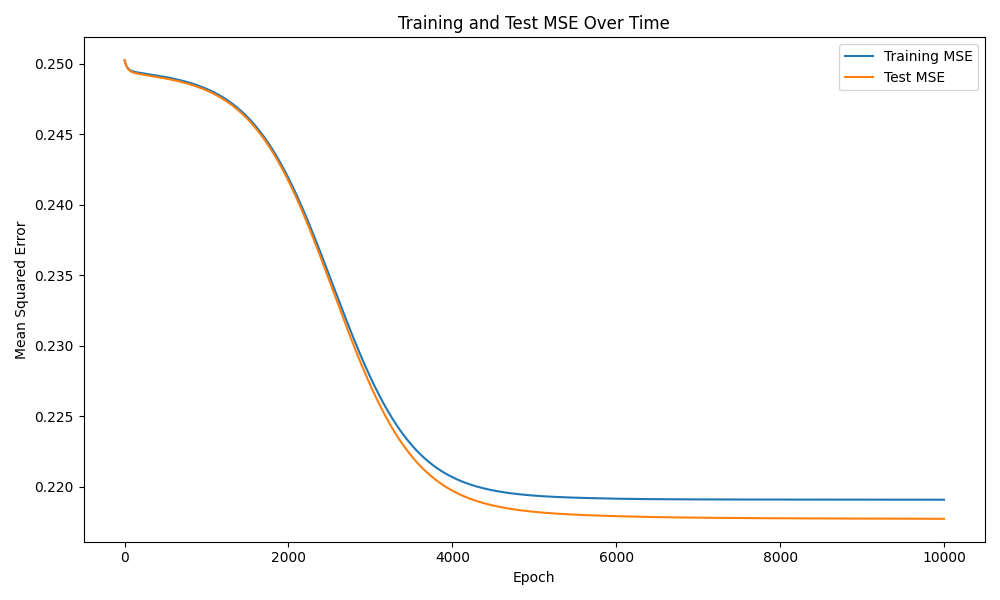

# Module 12 — Neural Network (NumPy Admissions Prediction)

**Name:** Andres Sanchez-Castellanos  
**JHED ID:** asanch69  
**Course:** EN.605.256 Modern Software Concepts in Python  
**Module:** Module 12 — Neural Network

---

# Sources

- Course lecture materials  
- Real Python — Python AI Neural Network  
- PyTorch Step-by-Step Guide (conceptual reference)  
- NumPy documentation  
- pandas documentation  
- matplotlib documentation  
- ChatGPT  :contentReference[oaicite:0]{index=0}

---

# Overview

Module 12 implements a **two-layer neural network built from scratch using NumPy** to predict graduate admissions outcomes.

This module introduces:

1. **Data Preparation**  
Admissions data is cleaned, filtered, and transformed into structured model inputs.

2. **Feature Engineering**  
Six input features are used:

- GPA  
- GRE  
- GRE Verbal  
- GRE Analytical Writing  
- Degree Type (Masters vs PhD)  
- Applicant Origin (International vs Local)

3. **Neural Network Construction**  
A fully connected two-layer neural network is implemented manually using:

- Forward propagation  
- Sigmoid activation  
- Backpropagation  
- Gradient descent  

4. **Model Evaluation**  
Performance is evaluated using:

- Mean Squared Error (MSE)  
- Classification Accuracy  
- Early Stopping  
- Artificial Applicant Predictions

---

# Data Preparation

Dataset used:

llm_extend_applicant_data.json

Processing steps:

- Filtered to:
  - Accepted
  - Rejected

- Filtered to:
  - Masters
  - PhD

- Parsed embedded string values such as:

- GPA 3.89  
- GRE 327  
- GRE V 157  
- GRE AW 3.50

- Extracted numeric values using regex

- Converted invalid or non-positive values to missing

- Filled missing values using **training-set medians only** to prevent data leakage

---

# Dataset Summary

- Original rows: 49,960  
- Rows after filtering: 35,413  

Train/Test Split:

- Training rows: 28,330  
- Test rows: 7,083

---

# Neural Network Architecture

Architecture:

Input Layer:

6 features

Hidden Layer:

6 neurons

Output Layer:

1 neuron (admission probability)

Hyperparameters:

- Learning Rate = 0.05  
- Max Epochs = 10000  
- Patience = 100  

Activation:

Sigmoid

Loss Function:

Mean Squared Error (MSE)

---

# Training Results

Final Evaluation:

- Best Epoch: 10000  
- Best Test MSE: 0.217724  
- Final Training Accuracy: 0.6688  
- Final Test Accuracy: 0.6729

Observation:

The model exceeds the expected performance threshold and demonstrates meaningful predictive structure.

---

# MSE Learning Curve

This plot shows:

- Training MSE decreasing over time  
- Test MSE decreasing over time  
- Stable convergence behavior  
- No major overfitting observed

---

# Artificial Applicant Analysis

Two synthetic applicants were tested.

Applicant 1

- GPA: 3.9  
- GRE: 330  
- PhD  
- International

Predicted:

- Probability: 0.413  
- Rejected

Applicant 2

- GPA: 3.2  
- GRE: 300  
- Masters  
- Local

Predicted:

- Probability: 0.771  
- Accepted

Interpretation:

These predictions are consistent with patterns likely present in the dataset.

The model appears to place meaningful weight on:

- Degree type  
- International vs local status

and not solely on GPA/GRE values.

This likely reflects structural admissions patterns in the training data.

---

# Key Observations

- Missing data required median imputation  
- GRE/GPA values contained substantial noise  
- Degree type and applicant origin appear influential  
- The model learned meaningful structure  
- Final test accuracy reached approximately 67%

---

# Running the Code

Run:

    python neural_network.py

This will:

- Load and clean data  
- Train neural network  
- Save training.log  
- Save mse_curve.png  
- Print artificial applicant predictions  
- Print final evaluation metrics

---

# Reflection

This assignment demonstrated how a neural network can be built from first principles using only NumPy.

Major lessons:

- Data quality strongly affects model performance  
- Missing values and imputation matter significantly  
- Neural networks can learn meaningful patterns even with noisy data  
- Feature design can matter as much as model architecture

The results also show that machine learning models may reflect patterns present in data, rather than idealized real-world decision logic.

---

# Summary

This module demonstrates a complete machine learning workflow:

- Data cleaning  
- Feature engineering  
- Neural network implementation  
- Model training  
- Model evaluation  
- Prediction analysis

The model successfully predicts admissions outcomes and achieves approximately **67% test accuracy**, exceeding the expected performance baseline.